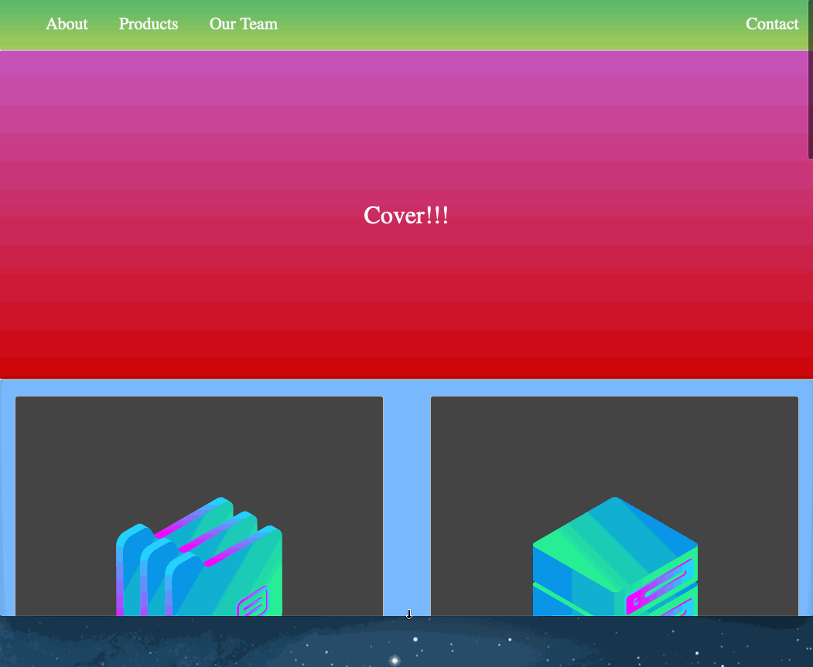

<h1>RESPONSIVE HTML LAYOUT</h1>

<h1>

</h1>

##  🗂 ABOUT 

 **Responsive html layout project** was created with the intention of putting our knowledge in responsive htlm and css
 into practice, and can be used with a template to create a responsive index website. Created by **Andrei Neagoie**(Senior Software Developer turned Instructor)
 and Developed by **Davi Pontes da Silva.**
                                                                                                 
---

## 🚀 CODE STYLE 

 - [Html](https://www.w3schools.com/html/html_basic.asp)
 - [Css](https://www.w3schools.com/css/default.asp)
 - [@media](https://css-tricks.com/snippets/css/media-queries-for-standard-devices/)
 - [Css grid](https://css-tricks.com/video-screencasts/153-getting-started-with-css-grid/)
 
 ---
 
## LIVE DEMO 
[live](https://confident-mccarthy-a57620.netlify.app/)
 
 ---
 
 ## 💾 Download the Project 
 
 ```bash
#Clone a Repository
$ git clone https://github.com/davipontesdasilva/resposive-html-layout.git


```

---

## Acknowledgements 

[The Complete Web Developer in 2020: Zero to Mastery](https://www.udemy.com/course/the-complete-web-developer-zero-to-mastery/)

Developed by Davi Pontes da Silva